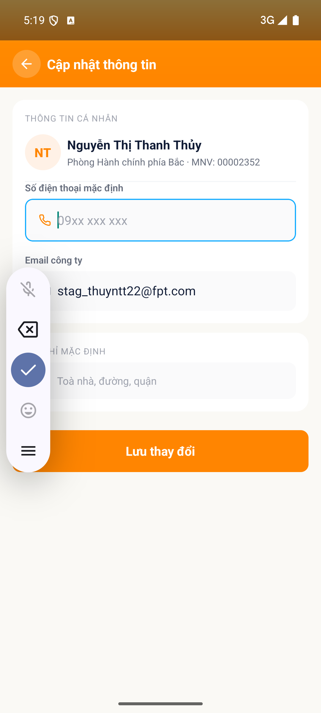
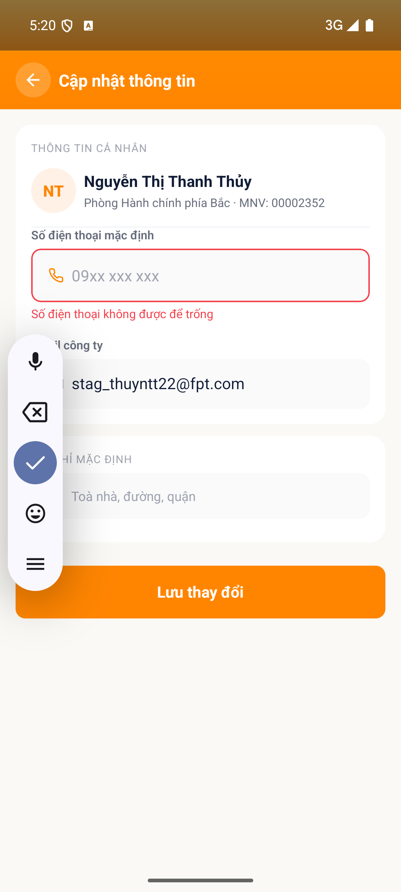

# [USR - Tài khoản & Hồ sơ] - Không load SĐT và địa chỉ mặc định từ HRIS

> Jira: [chưa push] · Status: Open

<!-- jira:description:start — copy nguyên khối dưới đây vào field Description của Jira -->

**I. Môi trường**

- URL: N/A (mobile app, không phải web)
- Account/Role: CBNV `stag_thuyntt22@fpt.com` — Nguyễn Thị Thanh Thủy, MNV 00002352, Phòng Hành chính phía Bắc (tài khoản **chưa từng lưu thông tin** ở màn "Cập nhật thông tin")
- Trình duyệt / Thiết bị: emulator-5554, Android, 1080x2400, UiAutomator2
- Build/Version: STG · v1.1

**II. Mô tả Bug**

**Pre-condition:**

- CBNV chưa từng bấm "Lưu thay đổi" ở màn "Cập nhật thông tin" của FoxEco (lần đầu mở màn).
- HRIS có sẵn **cả** số điện thoại **lẫn** địa chỉ làm việc của CBNV đó — đây là **dữ liệu mặc định luôn có**: khi tạo nhân viên trên HRIS, 2 trường này là **bắt buộc** (QC GiangDC2 chốt 2026-09-18).

**Steps:**

1. Đăng nhập app FoxPro bằng tài khoản CBNV → vào menu "Chức năng" → nhấn icon FoxEco
2. Nhấn tab "Cá nhân" ở bottom nav
3. Nhấn mục menu "Cập nhật thông tin cá nhân"
4. Quan sát field "Số điện thoại mặc định" và field "Địa chỉ mặc định" ngay khi màn vừa mở, **trước khi** gõ gì

**Expected result:**

- Field "Số điện thoại mặc định" hiển thị đúng số điện thoại của CBNV trên HRIS và cho phép nhập.
- Field "Địa chỉ mặc định" hiển thị đúng địa chỉ làm việc của CBNV trên HRIS và cho phép nhập.
- Căn cứ: BA chốt 2026-09-16 (*"mặc định load HRIS, cho sửa"*) + PRD `§8.15.2` (*"số điện thoại hiện tại"*, *"địa chỉ làm việc trong hồ sơ"*).

**Actual result:**

- **CẢ HAI field đều RỖNG** — chỉ hiển thị chữ gợi ý (placeholder) `09xx xxx xxx` và `Toà nhà, đường, quận`. App **không load bất kỳ giá trị nào từ HRIS**.
- Xác nhận bằng accessibility tree: cả 2 `EditText` đều có `showing-hint="true"` (⚠️ thuộc tính `text` vẫn trả về chuỗi placeholder, nên nhìn qua log dễ tưởng field có dữ liệu).
- Đối chiếu HRIS **của chính tài khoản này**, đọc tại chỗ cùng ngày (FoxPro → Cá nhân → Thông tin cá nhân → Thông tin): trường **"Điện thoại" CÓ giá trị hợp lệ** (10 số, bắt đầu bằng 0).
- Vế *"cho phép nhập"* của Expected thì **ĐẠT** (con trỏ + bàn phím hiện đúng) — lỗi nằm ở **vế nạp dữ liệu**.

**Phạm vi ảnh hưởng:**

- Tái hiện trên **2 tài khoản khác nhau, 2 phiên test khác nhau**: tài khoản A (MNV 00131946, VR-001 — tài khoản có địa chỉ HRIS đã biết là `HCM LôB3,E-Office,KCN TânThuận`) và tài khoản MNV 00002352 (VR-003) ⇒ **không phải lỗi dữ liệu của một tài khoản**.
- Ảnh hưởng **100% CBNV dùng FoxEco lần đầu**: ai cũng phải tự gõ lại thông tin mà hệ thống đã có sẵn.
- **Lan sang module ORD:** địa chỉ mặc định rỗng ⇒ ô "địa chỉ lấy hàng" khi đăng tin cũng không có gì để prefill.

**Hình ảnh mô tả:**

<!-- jira:description:end -->

## Status History

| Ngày | Status | Ghi chú | Ref |
|---|---|---|---|
| 2026-09-18 | Open | Log từ 2 TC FAIL cùng 1 defect (`TC-USR-040` + `TC-USR-043`) — ứng viên bug **B9** của VR-003 | VR-003-USR-2026-09-18 |

## Ghi chú nội bộ (không push Jira)

- **Vì sao gộp 2 TC vào 1 bug:** cùng một nguyên nhân (không nạp dữ liệu HRIS vào form), cùng một màn, cùng một thời điểm xảy ra. Tách 2 bug sẽ tạo 2 luồng fix cho 1 nguyên nhân.
- **Severity `Major`, không phải `Medium`:** khác các bug lệch câu chữ của VR-001, đây là **một yêu cầu chức năng không được thực hiện chút nào** và chạm **mọi người dùng mới**. ⚠️ Nếu QC thấy nên hạ xuống `Medium` thì sửa trước khi push — AI không tự quyết mức này.
- **Giới hạn oracle đã ghi nhận:** app HRIS mobile **không phơi** trường "địa chỉ làm việc / văn phòng" cho chính người dùng (đã kiểm cả *Thông tin* lẫn *Quá trình làm việc*), nên với tài khoản 00002352 không đọc được chuỗi văn phòng kỳ vọng. Điều này **không làm yếu bug**: QC đã chốt HRIS luôn có địa chỉ mặc định, và tài khoản A ở VR-001 có chuỗi văn phòng đã biết vẫn cho kết quả rỗng y hệt.
- **Chưa push Jira** theo yêu cầu QC 2026-09-18. Khi push: `/log-bug --push-jira BUG-008` (nhớ `Parent = FE-1`, `Fix versions = V1.0`, `Test Round = 1`).
