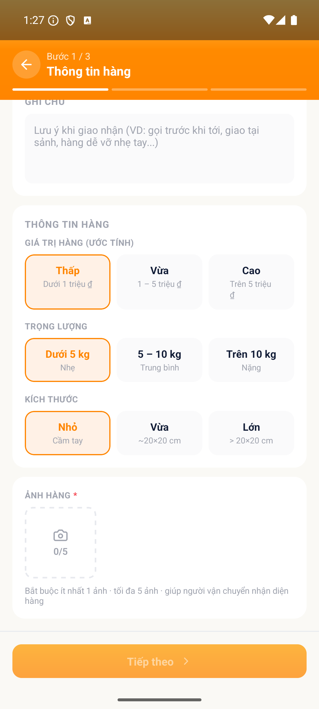
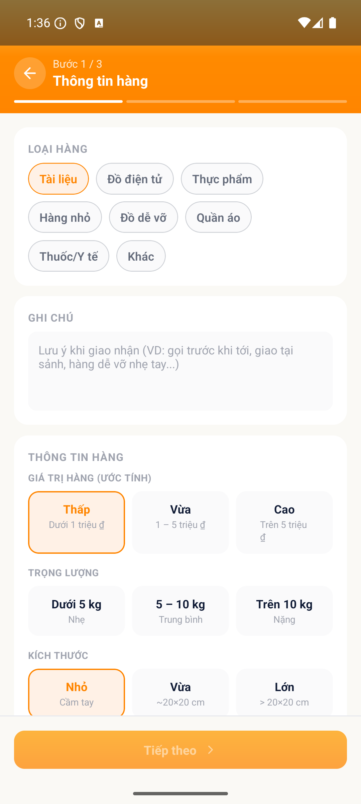
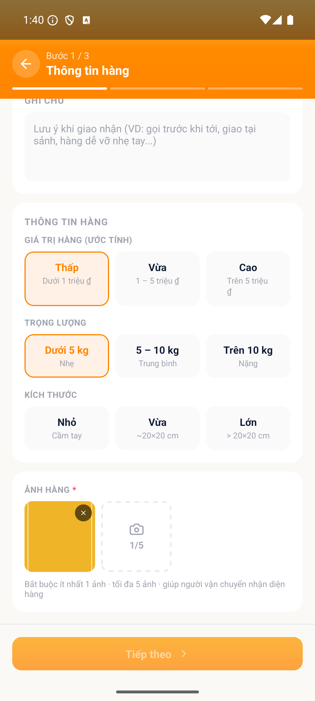
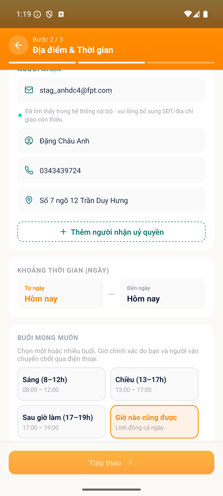
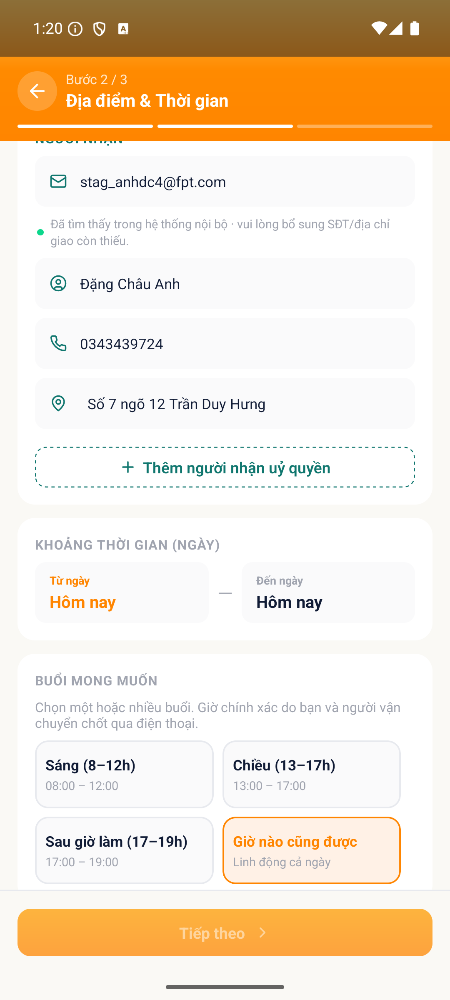
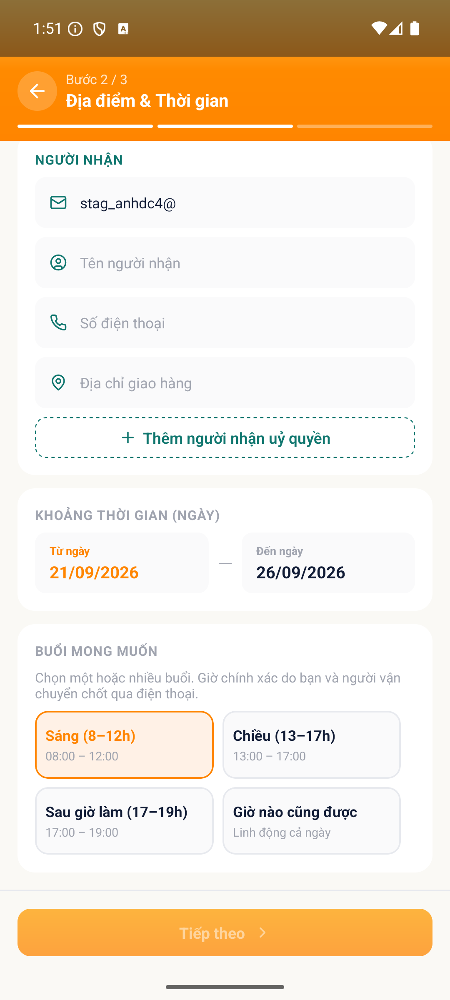

# [ORD - Đăng tin & Quản lý tin] - Chặn sang bước sau nhưng không hiện lỗi ở trường thiếu

> Jira: [chưa push] · Status: Open

<!-- jira:description:start — copy nguyên khối dưới đây vào field Description của Jira -->

**I. Môi trường**

- URL: N/A (FoxEco là SDK nhúng trong host app mobile FoxPro, không có URL riêng)
- Account/Role: CBNV `Đặng Châu Giang`, MNV 00131946 (tài khoản A) — vai SENDER
- Trình duyệt / Thiết bị: emulator-5554, Android, 1080x2400, UiAutomator2
- Build/Version: STG · v1.1 · host app `com.hrisproject.stag` (FoxPro)

**II. Mô tả Bug**

**Pre-condition:**

- Tài khoản A là CBNV có hồ sơ đầy đủ trên STG, đã đăng nhập host app FoxPro.
- Thư viện ảnh thiết bị có sẵn bộ ảnh mẫu `SEED-ORD-01` (dùng cho các nhánh cần tải ảnh).

**Steps:** *(luồng đại diện — nhánh thiếu ẢNH HÀNG, `TC-ORD-063`, P1)*

1. Đăng nhập app FoxPro → menu "Chức năng" → nhấn icon FoxEco
2. Nhấn "+ Đăng tin" → nhấn card "Tôi cần gửi hàng"
3. Chọn chip "Thấp (Dưới 1 triệu đ)" ở khối "GIÁ TRỊ HÀNG (ƯỚC TÍNH)"
4. Chọn chip "Dưới 5 kg (Nhẹ)" ở khối "TRỌNG LƯỢNG"
5. Chọn chip "Nhỏ · Cầm tay" ở khối "KÍCH THƯỚC"
6. Nhấn "Tiếp theo" khi **chưa tải ảnh nào**
7. Quan sát khối "ẢNH HÀNG" — tìm thông báo lỗi

**Expected result:**

- Wizard vẫn ở bước 1, không sang được bước 2, **và có thông báo lỗi ở khối "ẢNH HÀNG"**.
- Tương tự cho 5 nhánh validate còn lại: mỗi nhánh vừa chặn vừa **hiện lỗi tại đúng trường thiếu/sai** (bảng dưới).

**Actual result:**

- Vế **chặn** đúng ở cả 6 nhánh (nút "Tiếp theo" `enabled=false` / wizard giữ nguyên bước).
- Vế **báo lỗi SAI ở cả 6 nhánh**: không có thông báo lỗi nào xuất hiện. Người dùng bị khoá nút mà **không có bất kỳ dấu hiệu nào cho biết thiếu/sai ở đâu**.

| TC | Nhánh validate | Chặn? | Thông báo lỗi? | Kiểm chứng |
|---|---|---|---|---|
| `TC-ORD-063` **(P1)** | chưa tải ảnh nào | ✓ có | ✗ **không** | khối "ẢNH HÀNG" chỉ có dòng helper tĩnh |
| `TC-ORD-064` | chưa chọn TRỌNG LƯỢNG | ✓ có | ✗ **không** | nhãn khối + 3 chip hiển thị đúng, chỉ thiếu lỗi |
| `TC-ORD-066` | chưa chọn KÍCH THƯỚC | ✓ có | ✗ **không** | 3 chip hiển thị đúng, chỉ thiếu lỗi |
| `TC-ORD-083` | địa chỉ giao trùng hệt địa chỉ lấy | ✓ có | ✗ **không** | tìm text chứa "trùng" → NOT FOUND |
| `TC-ORD-084` | trùng, chỉ khác khoảng trắng đầu/cuối | ✓ có (có trim) | ✗ **không** | — |
| `TC-ORD-077` | email sai định dạng `stag_anhdc4@` | ✓ có | ✗ **không** | 3 ô tên/SĐT/địa chỉ vẫn trống (không tra danh bạ) — đúng; chỉ thiếu lỗi định dạng |

**Phạm vi ảnh hưởng:**

- 6 nhánh validate trải **cả bước 1 lẫn bước 2** của wizard NEED ⇒ người dùng có thể bị kẹt ở bất kỳ bước nào mà không biết lý do.
- Đây **không phải** hạn chế của framework hiển thị lỗi: app **CÓ** báo lỗi đúng ở 4 nhánh khác trong cùng màn — ảnh > 5MB (`TC-ORD-068`), chưa chọn buổi (`TC-ORD-058`: *"Chọn ít nhất 1 buổi"*), khoảng ngày > 7 (`TC-ORD-057`), email ngoài tên miền (`TC-ORD-078`) ⇒ là **bỏ sót ở 6 nhánh**, không phải thiếu cơ chế.

**Căn cứ:** `BR01-01` (*"Thiếu ảnh thì chặn sang bước 2"*) · `BR01-02` (*"không cho để trống"*) · `AC-03.1.02` · `AC-04.2.01` · `§8.1.4` (*"Địa chỉ giao phải khác địa chỉ lấy"*) · `VAL-03` (có trim).

**Hình ảnh mô tả:**

<!-- jira:description:end -->

## Status History

| Ngày | Status | Ghi chú | Ref |
|---|---|---|---|
| 2026-09-18 | Open | Log từ 6 TC FAIL cùng 1 nguyên nhân — ứng viên bug **B1** của VR-002 | VR-002-ORD-2026-09-18 |

## Ghi chú nội bộ (không push Jira)

- **Vì sao gộp 6 TC vào 1 bug:** cùng một nguyên nhân (nhánh validate chạy nhưng không render thông báo lỗi), cùng một wizard. Tách 6 bug sẽ tạo 6 luồng fix cho 1 nguyên nhân — `vibe-report` VR-002 đã chốt gộp.
- **`severity: Major`** (report đề xuất *High* — enum local không có `High`, `High` là Priority Jira). Có 1 TC **P1** trong nhóm (`TC-ORD-063`); nếu QC muốn nâng `priority` lên `P1` thì sửa trước khi push — AI không tự quyết.
- **`effect: Usability` / `defect_type: Interface`:** rule nghiệp vụ được **thi hành đúng**, phần hỏng là phản hồi cho người dùng. Nếu QC coi "hiện lỗi" là yêu cầu chức năng chưa làm thì đổi sang `Functionality`/`Logic`.
- ⛔ **Không được sửa Expected của 6 TC này theo app để làm xanh** — chúng là bằng chứng của bug (ghi rõ ở `vibe-report` VR-002).
- **Chưa push Jira** theo yêu cầu QC 2026-09-18. Khi push: `/log-bug --push-jira BUG-009` (nhớ `Parent = FE-1`, `Fix versions = V1.0`, `Test Round = 1`).
