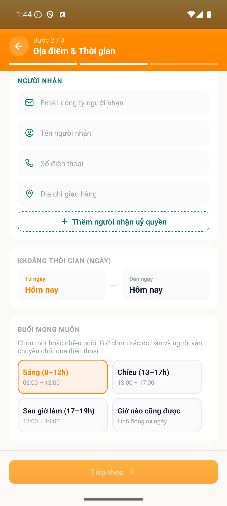

# [ORD - Đăng tin & Quản lý tin] - Vẫn chọn được buổi đã trôi qua trong ngày hôm nay

> Jira: [chưa push] · Status: Open

<!-- jira:description:start — copy nguyên khối dưới đây vào field Description của Jira -->

**I. Môi trường**

- URL: N/A (FoxEco là SDK nhúng trong host app mobile FoxPro, không có URL riêng)
- Account/Role: CBNV `Đặng Châu Giang`, MNV 00131946 (tài khoản A) — vai SENDER
- Trình duyệt / Thiết bị: emulator-5554, Android, 1080x2400, UiAutomator2
- Build/Version: STG · v1.1 · host app `com.hrisproject.stag` (FoxPro)

**II. Mô tả Bug**

**Pre-condition:**

- Tài khoản A là CBNV có hồ sơ đầy đủ trên STG, đã đăng nhập host app FoxPro.
- **Thời điểm chạy là sau 12 giờ trưa** để buổi "Sáng (8–12)" đã trôi qua *(phiên test thực hiện lúc 13:44)*.

**Steps:**

1. Đăng nhập app FoxPro → menu "Chức năng" → nhấn icon FoxEco
2. Nhấn "+ Đăng tin" → nhấn card "Tôi cần gửi hàng" → nhập đủ trường bước 1 → nhấn "Tiếp theo"
3. Ở bước 2, chọn "Từ ngày" và "Đến ngày" đều là **ngày hiện tại**
4. Nhấn chọn buổi **"Sáng (8–12)"**
5. Quan sát trạng thái chọn của chip "Sáng (8–12)"

**Expected result:**

- Buổi "Sáng (8–12)" **không chọn được**, giữ nguyên trạng thái không được chọn hoặc bị vô hiệu hoá.

**Actual result:**

- Buổi "Sáng (8–12)" **CHỌN ĐƯỢC bình thường** — chip chuyển sang trạng thái đã chọn (viền cam + chữ cam), không bị vô hiệu hoá, không có cảnh báo nào.

**Phạm vi ảnh hưởng:**

- Người gửi có thể đăng tin hẹn giao vào một khung giờ **đã trôi qua** ngay trong ngày ⇒ tin không thể được đáp ứng, người vận chuyển nhận rồi mới phát hiện vô nghĩa.

**Căn cứ:** `C-ORD-15(b)` — BA chốt 2026-09-17: *"app CHẶN chọn buổi đã qua trong ngày"*. ⚠️ Rule này **không có trong PRD**; câu trả lời của BA tại `C-ORD-15` là **nguồn chốt duy nhất**.

**Hình ảnh mô tả:**

<!-- jira:description:end -->

## Status History

| Ngày | Status | Ghi chú | Ref |
|---|---|---|---|
| 2026-09-18 | Open | Log từ `TC-ORD-059` FAIL — ứng viên bug **B6** của VR-002 | VR-002-ORD-2026-09-18 |

## Ghi chú nội bộ (không push Jira)

- 🔴 **Bắt buộc dẫn `C-ORD-15` khi trao đổi với dev/BA:** rule không nằm trong PRD nên dev có thể phản hồi *"spec không yêu cầu"*. Phần **Căn cứ** trong Description đã ghi rõ — ⛔ đừng cắt bỏ khi push.
- **`severity: Medium`** đúng như report VR-002 đề xuất: rule bị bỏ sót hoàn toàn nhưng chỉ ảnh hưởng một khung chọn, không chặn luồng chính.
- **Pre-condition phụ thuộc thời điểm chạy** — retest phải thực hiện **sau 12h trưa**, nếu không sẽ PASS giả.
- **Chưa push Jira** theo yêu cầu QC 2026-09-18. Khi push: `/log-bug --push-jira BUG-011` (nhớ `Parent = FE-1`, `Fix versions = V1.0`, `Test Round = 1`).
