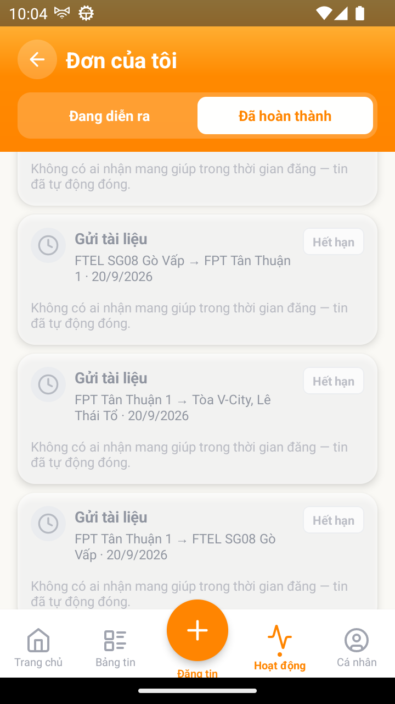

# [ACT - Hoạt động] - Lý do trên card đơn Hết hạn hiện sai chuỗi chính thức

> Jira: [chưa push] · Status: Open · ⏳ **chờ QC review trước khi push**

<!-- jira:description:start — copy nguyên khối dưới đây vào field Description của Jira -->

**I. Môi trường**

- URL: N/A (FoxEco là SDK nhúng trong host app mobile FoxPro, không có URL riêng)
- Account/Role: CBNV `Đặng Châu Anh` (`stag_anhdc4@`) — người gửi, có nhiều tin đã hết hạn
- Trình duyệt / Thiết bị: emulator-5554 (Android), UiAutomator2
- Build/Version: STG · v1.1 · host app `com.hrisproject.stag` (FoxPro)

**II. Mô tả Bug**

**Pre-condition:**

- Tài khoản có ít nhất 1 tin đã hết hạn (không ai nhận mang giúp trong thời gian đăng).

**Steps:**

1. Đăng nhập app FoxPro → menu "Chức năng" → nhấn icon FoxEco
2. Nhấn tab "Hoạt động" ở thanh tab dưới, rồi nhấn tab con "Đã hoàn thành"
3. Quan sát badge và dòng lý do trên card đơn "Hết hạn"

**Expected result:**

- Card hiển thị badge "Hết hạn" kèm dòng lý do đúng chuỗi **"Không có ai nhận mang giúp trong thời gian đăng"** *(TC-ACT-008; PRD `DOC-v1.1-01` §8.5.1 BR05-03 + AC-09.1.01)*.

**Actual result:**

- Badge "Hết hạn" đúng, nhưng dòng lý do là **"Không có ai nhận mang giúp trong thời gian đăng — tin đã tự động đóng."** — thừa vế "— tin đã tự động đóng." so với chuỗi chính thức. Lặp lại ở **mọi** card Hết hạn trong danh sách (~30 card).

**Hình ảnh mô tả:**

<!-- jira:description:end -->

## Ghi chú cho QC review (local, không push)

- Bản dài chính là chuỗi bản v1.0 của TC này đang assert (`KB-ORD-07` #4). PRD v1.1 lần đầu gọi tên chuỗi và dùng bản ngắn ⇒ `defect_type: Requirement` (spec đổi, app chưa theo).
- ⚠️ Nên hỏi BA 1 câu trước khi push: PRD v1.1 **cố ý** rút ngắn chuỗi, hay chỉ viết tắt khi trích? Nếu BA giữ bản dài ⇒ sửa Expected TC-ACT-008, xoá bug này.

## Status History

| Ngày | Status | Ghi chú | Ref |
|---|---|---|---|
| 2026-09-21 | Open | Log từ vibe-test FAIL `TC-ACT-008` step 2 — chờ QC review | VR-017-ACT-2026-09-21 |
