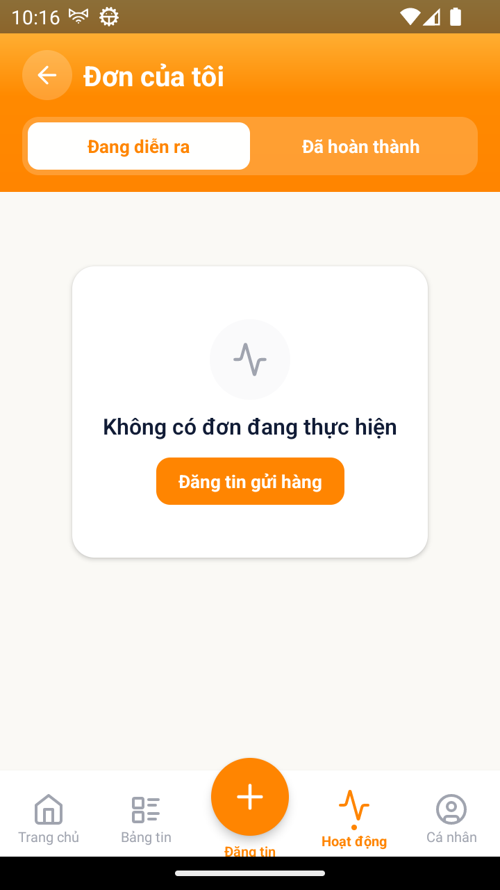

# [ACT - Hoạt động] - Empty state tab Đang diễn ra thiếu dòng giải thích

> Jira: [chưa push] · Status: Open · ⏳ **chờ QC review trước khi push**

<!-- jira:description:start — copy nguyên khối dưới đây vào field Description của Jira -->

**I. Môi trường**

- URL: N/A (FoxEco là SDK nhúng trong host app mobile FoxPro, không có URL riêng)
- Account/Role: CBNV `Nguyễn Đình Nhật Minh` (`stag_MinhNDN2@`) — tài khoản trắng, 0 đơn ở cả 2 tab
- Trình duyệt / Thiết bị: emulator-5554 (Android), UiAutomator2
- Build/Version: STG · v1.1 · host app `com.hrisproject.stag` (FoxPro)

**II. Mô tả Bug**

**Pre-condition:**

- Tài khoản không có đơn nào đang thực hiện (từ "Chờ ghép" đến "Đã giao").

**Steps:**

1. Đăng nhập app FoxPro bằng tài khoản không có đơn → menu "Chức năng" → nhấn icon FoxEco
2. Nhấn tab "Hoạt động" ở thanh tab dưới (mặc định mở tab con "Đang diễn ra")
3. Quan sát vùng danh sách: icon, dòng tiêu đề, dòng giải thích, số nút CTA

**Expected result:**

- Vùng danh sách hiện icon nét mảnh màu neutral, dòng tiêu đề đúng chuỗi "Không có đơn đang thực hiện", **1 dòng giải thích**, và đúng 1 nút CTA nhãn "Đăng tin gửi hàng" *(TC-ACT-012; PRD `DOC-v1.1-01` §8.17.1 EMP-05 + §8.17.2 BR17-01: "Mỗi empty state gồm: icon nét mảnh màu neutral + một dòng tiêu đề + một dòng giải thích + tối đa một CTA.")*.

**Actual result:**

- Có icon, tiêu đề "Không có đơn đang thực hiện" và đúng 1 nút "Đăng tin gửi hàng", nhưng **không có dòng giải thích** nào giữa tiêu đề và nút (page source chỉ có 2 text trong vùng danh sách).

**Hình ảnh mô tả:**

<!-- jira:description:end -->

## Ghi chú cho QC review (local, không push)

- PRD `EMP-05` **không ghi nguyên văn** dòng giải thích — chỉ `BR17-01` bắt buộc phải có ⇒ dev cần BA cấp chuỗi. Có thể đưa vào Jira dạng "thiếu thành phần theo BR17-01" như trên.
- Quan sát thêm (chưa TC nào FAIL vì nó): empty state tab **"Đã hoàn thành"** (`EMP-06`) cũng chỉ có icon + "Chưa có đơn hoàn tất", **không có dòng giải thích** — `TC-ACT-014` không assert vế này nên PASS. Nếu QC muốn gộp vào bug này thì thêm ảnh `08_test-runs/vibe/VR-017-ACT-2026-09-21/screenshots/TC-ACT-014__verify-chua-co-don-hoan-tat-khong-cta-khong-khoi-lich-su.png`.
- Cùng họ với `FE-310` (empty state "Đơn của tôi" ở Trang chủ sai chuỗi, thiếu CTA, thiếu icon).

## Status History

| Ngày | Status | Ghi chú | Ref |
|---|---|---|---|
| 2026-09-21 | Open | Log từ vibe-test FAIL `TC-ACT-012` step 3 — chờ QC review | VR-017-ACT-2026-09-21 |
