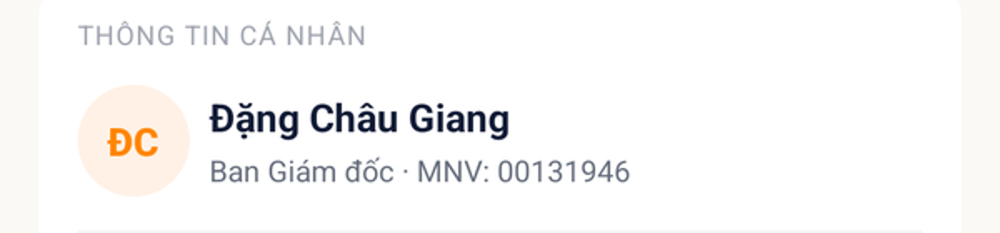

# [USR - Tài khoản & Hồ sơ] - Mã nhân viên bị cắt, hiển thị không đầy đủ

> Jira: [FE-297](https://foxproject.atlassian.net/browse/FE-297) · Status: Open

<!-- jira:description:start — copy nguyên khối dưới đây vào field Description của Jira -->

**I. Môi trường**

- URL: N/A (mobile app, không phải web)
- Account/Role: FOXECO_STG_USER_A — Đặng Châu Giang, MNV 00131946, Ban Giám đốc
- Trình duyệt / Thiết bị: emulator-5554, Pixel 7 AVD, 1080x2400, UiAutomator2
- Build/Version: STG · v1.1

**II. Mô tả Bug**

**Pre-condition:** Đã đăng nhập FoxEco, đang ở màn "Cập nhật thông tin".

**Steps:**

1. Vào màn "Cập nhật thông tin"
2. Quan sát dòng "Phòng ban · MNV" ngay dưới tên nhân viên

**Expected result:**

- Mã nhân viên (MNV) hiển thị đầy đủ, người dùng xem được trọn vẹn để đối chiếu/cập nhật thông tin khi cần

**Actual result:**

- QC quan sát trực tiếp: với phòng ban có tên dài, dòng "Phòng ban · MNV: xxxxxxxx" bị cắt bớt, MNV không hiển thị đủ ⇒ người dùng không xem được MNV đầy đủ
- **AI verify lại trên STG (device `emulator-5554`, tài khoản A):** dòng này nằm trong **container 1 dòng, rộng cố định 770px** (`bounds=[226,525][996,567]`, cao đúng 1 dòng text — không wrap), nên **không có cơ chế xuống dòng** khi chuỗi "Phòng ban · MNV: ..." vượt quá độ rộng khả dụng. Với tài khoản A ("Ban Giám đốc", 8 số MNV) chuỗi còn ngắn nên **chưa quan sát được ký tự bị cắt trên tài khoản này** — không đủ điều kiện tái hiện độc lập ngay trong phiên (đổi tài khoản cần OTP nhập tay). Ghi nhận theo báo cáo trực tiếp của QC + bằng chứng cấu trúc UI (container không wrap) ủng hộ khả năng tràn chữ khi tên phòng ban dài hơn
- Ghi nhận là defect thật (`severity: Low`, `defect_type: Interface`) theo quyết định QC 2026-09-18 sau khi board Jira bắt buộc chọn Defect Type lúc tạo issue — đề xuất fix: cho wrap 2 dòng hoặc rút gọn tên phòng ban thay vì cắt cứng MNV

**Hình ảnh mô tả:**

<!-- jira:description:end -->

## Status History

| Ngày | Status | Ghi chú | Ref |
|---|---|---|---|
| 2026-09-18 | Open | QC báo trực tiếp: màn "Cập nhật thông tin" cắt MNV khi phòng ban dài, chỉ định `severity: Suggest`. AI verify trên tài khoản A không tái hiện được (phòng ban "Ban Giám đốc" quá ngắn để tràn) nhưng xác nhận container là 1 dòng cố định, không wrap — ủng hộ khả năng lỗi với phòng ban dài hơn. Cần tài khoản có tên phòng ban dài hơn (đổi tài khoản cần OTP) để có ảnh chụp trực tiếp trạng thái bị cắt | recheck 2026-09-18 |
| 2026-09-18 | Open | Push Jira bị chặn: board FE bắt buộc `Defect Type` khi tạo issue (dù metadata khai `required:false`), xung đột với rule "Suggest không điền defect_type". QC quyết định: đổi `severity: Suggest` → `Low`, `defect_type: Interface`, `priority: P5` → `P4` — coi đây là defect thật (lỗi hiển thị UI) thay vì đề xuất cải tiến | quyết định QC 2026-09-18 |
