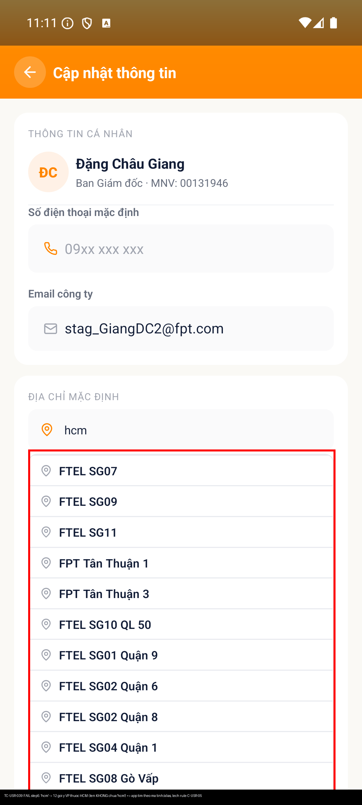

# [USR - Tài khoản & Hồ sơ] - Gợi ý địa chỉ tìm theo mã tỉnh, không theo tên VP

> Jira: [FE-298](https://foxproject.atlassian.net/browse/FE-298) · Status: Open

<!-- jira:description:start — copy nguyên khối dưới đây vào field Description của Jira -->

**I. Môi trường**

- URL: N/A (mobile app, không phải web)
- Account/Role: FOXECO_STG_USER_A — Đặng Châu Giang, MNV 00131946, Ban Giám đốc
- Trình duyệt / Thiết bị: emulator-5554, Pixel 7 AVD, 1080x2400, UiAutomator2
- Build/Version: STG · v1.1

**II. Mô tả Bug**

**Pre-condition:** Đã đăng nhập FoxEco, đang ở màn "Cập nhật thông tin", field "Địa chỉ mặc định" đang rỗng.

**Steps:**

1. Nhấn vào field "Địa chỉ mặc định"
2. Nhập từ khoá `hcm` (≥ 3 ký tự, đúng biên dưới cho phép gợi ý)
3. Quan sát danh sách gợi ý trả về

**Expected result:**

- Không hiển thị gợi ý nào, vì rule đã chốt là **chỉ tìm theo tên văn phòng (`name`)**, không theo mã tỉnh (`C-USR-05`, BA chốt 2026-09-16) — không văn phòng nào có `name` chứa chuỗi "hcm"

**Actual result:**

- App trả về **12 gợi ý**, toàn bộ là văn phòng thuộc tỉnh HCM (`FTEL SG07`, `FTEL SG09`, `FTEL SG11`, `FPT Tân Thuận 1`, `FPT Tân Thuận 3`, `FTEL SG10 QL 50`, `FTEL SG01 Quận 9`, `FTEL SG02 Quận 6`, `FTEL SG02 Quận 8`, `FTEL SG04 Quận 1`, `FTEL SG08 Gò Vấp`, `FTEL SG16 Quận 7`) — **không tên nào chứa chuỗi "hcm"**, chỉ khớp qua tiền tố mã tỉnh
- Kết luận này **độc lập với lệch master data STG** (xem P1 ở vibe-report) — chỉ cần "tên không chứa `hcm` mà vẫn được trả về" là đủ chứng minh app đang khớp trên field sai
- **Bằng chứng đối chiếu file dữ liệu gốc** `00_input/v1.1/location_address_catalog.xlsx` (sheet `location_address_catalog`, 399 dòng): cột `search_alias_text` = `search_text` (đã bỏ dấu, lowercase) ghép thêm **mã tỉnh ở đầu**. Ví dụ dòng 12: `name` = "82/20 Quang Trung, Gò Vấp" → `search_alias_text` = "hcm 82 20 quang trung go vap". Toàn bộ 34 dòng tỉnh HCM đều có `search_alias_text` bắt đầu bằng "hcm " ⇒ gõ "hcm" khớp được cả 12/34 dòng này (12 dòng còn tồn tại trên STG) chính vì app đang so khớp trên `search_alias_text`, không phải `name` — đúng như cảnh báo dự phòng ở `04_test-data/valid/USR-office-catalog.md §2 K6`

**Hình ảnh mô tả:**

<!-- jira:description:end -->

## Status History

| Ngày | Status | Ghi chú | Ref |
|---|---|---|---|
| 2026-09-18 | Open | Log từ vibe-test `VR-001-USR-2026-09-18` (ứng viên bug B5, `TC-USR-039` FAIL) | VR-001-USR-2026-09-18 |
| 2026-09-18 | Open | QC nghi ngờ đây không phải bug, đưa ví dụ gõ full `search_alias_text` (dòng 12: `hcm 82 20 quang trung go vap`) → ra đúng 1 gợi ý "82/20 Quang Trung". Recheck trực tiếp trên app (device `emulator-5554`, tài khoản A) **cùng phiên**, 2 case song song: (a) gõ đúng chuỗi full alias trên → ra đúng 1 gợi ý khớp — nhưng KHÔNG phản chứng được bug, vì chuỗi dài hơn `name` gốc nên chỉ khớp được khi so trên `search_alias_text`, tức là **thêm 1 bằng chứng nữa** app tìm sai field; (b) gõ lại `hcm` (case gốc B5) → **vẫn ra 12 gợi ý, không tên nào chứa "hcm"** — tái hiện y hệt. Evidence mới: `TC-USR-039__recheck-full-alias-string-1-goi-y.png`, `TC-USR-039__recheck-bare-hcm-12-goi-y.png`. **QC quyết định:** chờ dev thay đổi data + trao đổi lại, giữ nguyên `Open`, sẽ nhờ AI check lại khi có thông tin mới — ⛔ chưa đóng/hạ severity | VR-001-USR-2026-09-18, recheck 2026-09-18 |
| 2026-09-18 | Open | Push Jira theo yêu cầu QC. Tạo `FE-298`, đính kèm 3 ảnh (case gốc + 2 ảnh recheck), thêm comment nhờ dev xác nhận: (1) đây có phải bug cần sửa app chỉ so khớp theo `name`, hay là thiết kế có chủ đích cho lọc theo tỉnh; (2) nếu sửa thì cần đổi data nguồn hay chỉ đổi logic query | push 2026-09-18, comment `FE-298` #30500 |
