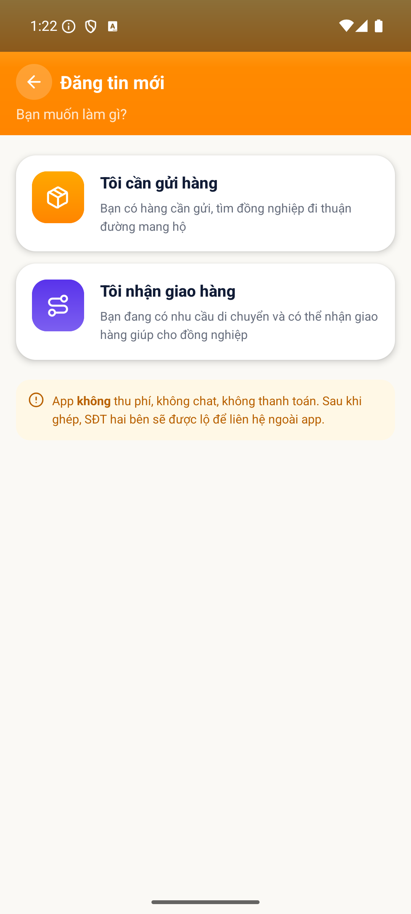

# [ORD - Đăng tin & Quản lý tin] - Thoát wizard không hiện popup xác nhận, mất dữ liệu đã nhập

> Jira: [FE-302](https://foxproject.atlassian.net/browse/FE-302) · Status: To Do

<!-- jira:description:start — copy nguyên khối dưới đây vào field Description của Jira -->

**I. Môi trường**

- URL: N/A (FoxEco là SDK nhúng trong host app mobile FoxPro, không có URL riêng)
- Account/Role: CBNV `Đặng Châu Giang`, MNV 00131946 (tài khoản A) — vai SENDER
- Trình duyệt / Thiết bị: emulator-5554, Android, 1080x2400, UiAutomator2
- Build/Version: STG · v1.1 · host app `com.hrisproject.stag` (FoxPro)

**II. Mô tả Bug**

**Pre-condition:**

- Tài khoản A là CBNV có hồ sơ đầy đủ trên STG, đã đăng nhập host app FoxPro.

**Steps:**

1. Đăng nhập app FoxPro → menu "Chức năng" → nhấn icon FoxEco
2. Nhấn "+ Đăng tin" → nhấn card "Tôi cần gửi hàng" → nhập đủ trường bước 1 → nhấn "Tiếp theo"
3. Ở bước 2, nhập "Số 9 Duy Tân" vào ô "Địa chỉ giao hàng"
4. Nhấn nút quay lại để đóng wizard (nhấn 2 lần: bước 2 → bước 1 → thoát)
5. Quan sát popup xác nhận thoát

**Expected result:**

- Hiện popup đúng chuỗi **"Thoát và bỏ nội dung đã nhập?"**; sau khi chọn *ở lại*, ô "Địa chỉ giao hàng" vẫn giữ nguyên "Số 9 Duy Tân".

**Actual result:**

- **Không có popup nào** — tìm phần tử chứa text "Thoát" → NOT FOUND.
- Nhấn "Quay lại" ở bước 1 **thoát thẳng khỏi wizard**, **toàn bộ dữ liệu đang soạn dở bị xoá sạch**, không có bất kỳ cảnh báo nào.
- Ghi nhận thêm về điều hướng: ở bước 2, "Quay lại" **về bước 1** (không đóng wizard) — nên phải nhấn 2 lần mới tới điểm thoát.

**Phạm vi ảnh hưởng:**

- Người dùng lỡ tay chạm "Quay lại" sau khi đã nhập gần hết form 2 bước sẽ **mất toàn bộ công nhập liệu**, không có đường hoàn tác.
- Nhánh *"chọn thoát trên popup"* (`TC-ORD-062`) cũng không thực hiện đúng kịch bản được vì popup không tồn tại.

**Căn cứ:** `AC-01.2.01` + `C-ORD-08` (BA chốt 2026-09-15: assert **verbatim** chuỗi popup).

**Hình ảnh mô tả:**

<!-- jira:description:end -->

## Status History

| Ngày | Status | Ghi chú | Ref |
|---|---|---|---|
| 2026-09-18 | Open | Log từ `TC-ORD-053` FAIL — ứng viên bug **B2** của VR-002 | VR-002-ORD-2026-09-18 |
| 2026-09-21 | To Do | Push Jira → FE-302 (QC GiangDC2 yêu cầu) | — |

## Ghi chú nội bộ (không push Jira)

- ⚠️ **Nghi cùng họ với `TC-USR-045`** (VR-001, cũng thiếu popup xác nhận rời màn). `vibe-report` VR-002 đề nghị xử lý ở **phạm vi hệ thống** chứ không riêng ORD. Bug này hiện log **theo scope ORD** vì đó là nơi có evidence; nếu dev xác nhận dùng chung component thì gộp — QC chốt trước khi push.
- **`severity: Major`** (report đề xuất *High* — enum local không có `High`). Lý do không để `Medium`: hậu quả là **mất dữ liệu người dùng**, không phải lệch hiển thị.
- **`defect_type: Logic`:** thiếu hẳn bước xác nhận trong luồng thoát, không phải lỗi hiển thị.
- **Đã push Jira 2026-09-21** → [FE-302](https://foxproject.atlassian.net/browse/FE-302) (Parent `FE-1` · Fix version `V1.0` · Test Round `1`, evidence đính kèm qua REST).
