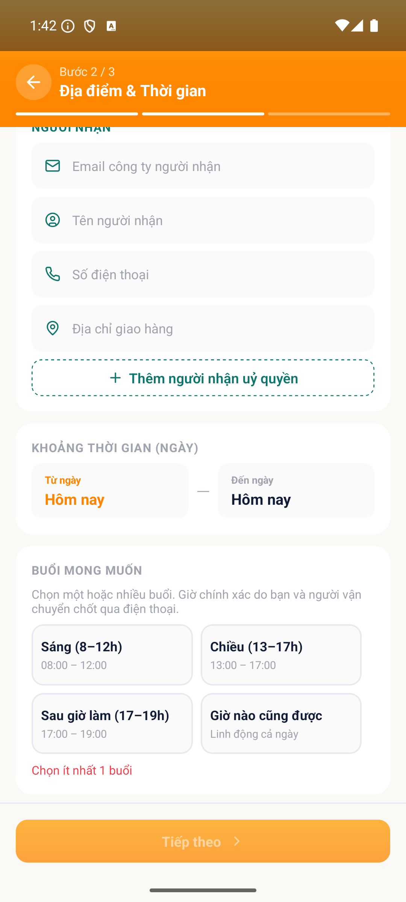

# [ORD - Đăng tin & Quản lý tin] - Buổi mong muốn không có giá trị mặc định Sau giờ làm

> Jira: [FE-304](https://foxproject.atlassian.net/browse/FE-304) · Status: To Do

<!-- jira:description:start — copy nguyên khối dưới đây vào field Description của Jira -->

**I. Môi trường**

- URL: N/A (FoxEco là SDK nhúng trong host app mobile FoxPro, không có URL riêng)
- Account/Role: CBNV `Đặng Châu Giang`, MNV 00131946 (tài khoản A) — vai SENDER
- Trình duyệt / Thiết bị: emulator-5554, Android, 1080x2400, UiAutomator2
- Build/Version: STG · v1.1 · host app `com.hrisproject.stag` (FoxPro)

**II. Mô tả Bug**

**Pre-condition:**

- Tài khoản A là CBNV có hồ sơ đầy đủ trên STG, đã đăng nhập host app FoxPro.

**Steps:**

1. Đăng nhập app FoxPro → menu "Chức năng" → nhấn icon FoxEco
2. Nhấn "+ Đăng tin" → nhấn card "Tôi cần gửi hàng" → nhập đủ trường bước 1 → nhấn "Tiếp theo"
3. Ở bước 2, quan sát nhóm "Thời gian" → field buổi mong muốn, **khi chưa chạm vào field**

**Expected result:**

- Buổi **"Sau giờ làm (17–19)"** đang ở trạng thái **được chọn sẵn**.

**Actual result:**

- **KHÔNG buổi nào được chọn sẵn.** Cả 4 chip (`Sáng (8–12)` · `Chiều (13–17)` · `Sau giờ làm (17–19)` · `Giờ nào cũng được`) đều ở trạng thái chưa chọn.
- App còn hiện **luôn lỗi đỏ "Chọn ít nhất 1 buổi"** ngay khi màn vừa mở, trong khi người dùng chưa thao tác gì.

**Phạm vi ảnh hưởng:**

- Mọi người dùng đăng tin NEED đều phải tự chọn buổi, mất đi giá trị mặc định mà PRD thiết kế để rút ngắn thao tác.
- Hiện lỗi đỏ ngay khi chưa thao tác làm form trông như đang sai, dù người dùng chưa nhập gì.
- ⚠️ **Nghi lan sang form OFFER**: PRD đặt **cùng giá trị mặc định** cho field `Buổi di chuyển` của FR02 (*"Chọn nhiều · mặc định Sau giờ làm"*). Nhánh OFFER **chưa được test** ở phiên này — đề nghị dev kiểm cả hai form khi fix.

**Căn cứ (PRD v1.1 — 2 chỗ):**

- **`§8.1.4` UI / Field Spec (FR01)**: `Buổi mong muốn | Có | Chọn nhiều · `**`mặc định Sau giờ làm`**` | Sáng (8–12) · Chiều (13–17) · Sau giờ làm (17–19) · Giờ nào cũng được`
- **`AC-06.1.01`** (Given): *"Người dùng đang ở nhóm 'Thời gian' ở bước 2, mặc định Từ ngày = hôm nay, Đến ngày = Từ ngày, **buổi = Sau giờ làm**."*

**Hình ảnh mô tả:**

<!-- jira:description:end -->

## Status History

| Ngày | Status | Ghi chú | Ref |
|---|---|---|---|
| 2026-09-18 | Open | Log từ `TC-ORD-058` FAIL — ứng viên bug **B5** của VR-002 | VR-002-ORD-2026-09-18 |
| 2026-09-21 | To Do | Push Jira → FE-304 (QC GiangDC2 yêu cầu) | — |

## Ghi chú nội bộ (không push Jira)

- ✅ **Đã xác minh lại PRD ngày 2026-09-18** (QC yêu cầu): mặc định `Sau giờ làm` có thật trong tài liệu, **2 chỗ độc lập** — bảng field `§8.1.4` và Given của `AC-06.1.01`. ⇒ ⛔ dev không phản bác được bằng lý do *"spec không yêu cầu"*.
- **`severity: Low`** đúng như report VR-002 đề xuất: chỉ mất tiện lợi, ⛔ không chặn luồng đăng tin (người dùng vẫn chọn buổi tay rồi đi tiếp bình thường).
- **Chi tiết phụ đáng để dev xem cùng lúc:** lỗi đỏ *"Chọn ít nhất 1 buổi"* hiện **ngay khi màn vừa mở**, trước mọi thao tác. Nếu mặc định được set đúng thì lỗi này cũng tự hết — nên ⛔ **không tách bug riêng**, chỉ ghi trong Actual.
- **Cần kiểm thêm khi retest:** field `Buổi di chuyển` của form **OFFER** (FR02) dùng cùng rule mặc định, chưa có TC nào chạy ⇒ nếu cũng rỗng thì mở rộng bug này thay vì log mới.
- **Đã push Jira 2026-09-21** → [FE-304](https://foxproject.atlassian.net/browse/FE-304) (Parent `FE-1` · Fix version `V1.0` · Test Round `1`, evidence đính kèm qua REST).
