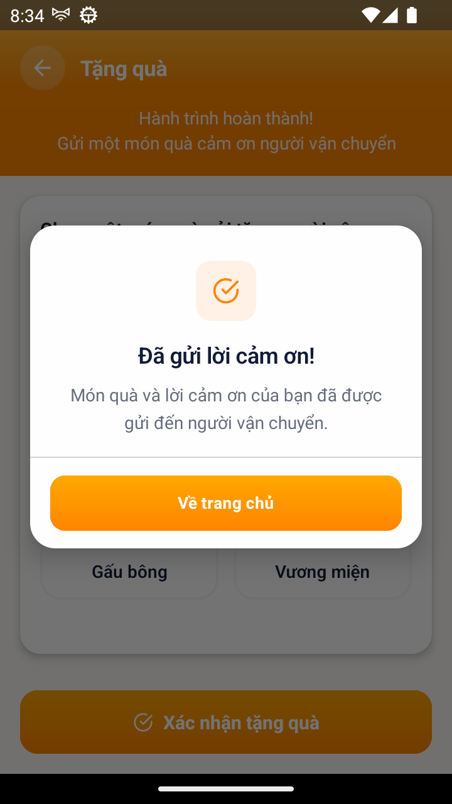

# [GIFT - Quà cảm ơn] - Popup sau khi tặng quà hiện chuỗi cũ, sai chuỗi chính thức BR14-02

> Jira: [FE-308](https://foxproject.atlassian.net/browse/FE-308) · Status: To Do · Assignee: Tuanvm37

<!-- jira:description:start — copy nguyên khối dưới đây vào field Description của Jira -->

**I. Môi trường**

- URL: N/A (FoxEco là SDK nhúng trong host app mobile FoxPro, không có URL riêng)
- Account/Role: CBNV `Phan Minh Tài` (`stag_taipm@`), MNV 00041796 — vai SENDER (người gửi quà)
- Trình duyệt / Thiết bị: emulator-5554, Android, 720x1280, UiAutomator2
- Build/Version: STG · v1.1 · host app `com.hrisproject.stag` (FoxPro)

**II. Mô tả Bug**

**Pre-condition:**

- Tài khoản người gửi có 1 đơn ở trạng thái **Hoàn thành**, **chưa từng tặng quà** (card đơn có hint `Chạm để tặng quà`).

**Steps:**

1. Đăng nhập app FoxPro → menu "Chức năng" → nhấn icon FoxEco
2. Nhấn tab "Hoạt động" → tab con "Đã hoàn thành"
3. Nhấn card đơn Hoàn thành chưa tặng quà → mở màn "Tặng quà"
4. Chọn loại quà "Bông hoa"
5. Nhấn nút "Xác nhận tặng quà"
6. Đọc tiêu đề và nội dung popup vừa hiện

**Expected result:**

- Quà gửi ngay, không có bước chờ xác nhận của người vận chuyển; popup hiện đúng chuỗi **"Cảm ơn của bạn đã được gửi"** kèm nút về trang chủ. *(BR14-02 · AC-24.1.01, `DOC-v1.1-01` §8.14.1 trang 49 · §6.2 trang 25)*

**Actual result:**

- Popup hiện **tiêu đề `Đã gửi lời cảm ơn!`** — chuỗi của v1.0 mà v1.1 đã chủ ý thay.
- Nội dung popup: `Món quà và lời cảm ơn của bạn đã được gửi đến người vận chuyển.`
- Chuỗi `Cảm ơn của bạn đã được gửi` **không xuất hiện** ở tiêu đề. Chỉ có cụm chữ thường `cảm ơn của bạn đã được gửi` nằm lẫn trong câu nội dung.
- Các vế còn lại đúng: quà gửi ngay (không có màn chờ), có nút `Về trang chủ`.

**Hình ảnh mô tả:**

<!-- jira:description:end -->

## Status History

| Ngày | Status | Ghi chú | Ref |
|---|---|---|---|
| 2026-09-21 | Draft | Soạn từ FAIL của `TC-GIFT-003` (VR-011, chạy 2026-09-19); chờ QC review | VR-011-GIFT-2026-09-19 |
| 2026-09-21 | To Do | QC GiangDC2 duyệt push → [FE-308](https://foxproject.atlassian.net/browse/FE-308), assignee Tuanvm37 (Parent `FE-1` · Fix version `V1.0` · Test Round `1` · Severity `2` · evidence đính kèm qua REST) | VR-011-GIFT-2026-09-19 |

## Ghi chú nội bộ (không push Jira) — 🔎 phần để QC review

- **Có phải bug thật không? — CÓ, mức thấp (lỗi nội dung hiển thị).** Evidence đủ: ảnh `step5-FAIL` + `get_text` qua MCP trả đúng 2 chuỗi trên. Không chặn luồng.
- **Điểm cần QC/BA chốt trước khi push — đọc chặt hay đọc lỏng `BR14-02`:**
  - **Đọc chặt (đang dùng để chấm FAIL):** BR14-02 nêu popup "Cảm ơn của bạn đã được gửi" (đặt trong dấu ngoặc kép). v1.1 chủ ý thay chuỗi v1.0 `Đã gửi lời cảm ơn!` (`C-GIFT-03` Resolved: chuỗi cũ dựa nguồn yếu). App vẫn giữ chuỗi cũ ⇒ sai copy ⇒ fix app.
  - **Đọc lỏng:** cụm `cảm ơn của bạn đã được gửi` có xuất hiện trong câu nội dung ⇒ nếu BA chấp nhận dạng nhúng thì **không phải bug**, `TC-GIFT-003` chuyển PASS và sửa Expected cho rõ. ⇒ **Nếu BA chọn đọc lỏng thì xoá draft này.**
- Mức đề xuất: P3 · Low (AI đề xuất, QC quyết). Độ tin cậy: cao về hiện tượng, trung bình về việc có phải lỗi.
- ⚠️ Đã tiêu 1 đơn Hoàn thành để tái hiện — **không chụp lại/tái hiện được nữa trên `stag_taipm@`** (xem `coverage-GIFT.md`, mục nợ seed). Ảnh `TC-GIFT-003__verify-popup-cam-on-da-duoc-gui.png` cùng phiên có thể dùng làm ảnh phụ.
- **Đã push Jira 2026-09-21** → [FE-308](https://foxproject.atlassian.net/browse/FE-308). Summary trên Jira theo convention project FE: `[TC_08 - Quà cảm ơn - Tặng quà] Popup sau khi tặng quà hiện chuỗi cũ, sai chuỗi chính thức BR14-02`. Board không bật Components / Affects Version ⇒ bỏ 2 field này.
- ⚠️ Vẫn còn câu hỏi mở với BA (đọc chặt/lỏng `BR14-02`) — nếu BA chọn đọc lỏng thì đóng FE-308 (Won't Fix / Cancel) và sửa Expected `TC-GIFT-003`.
