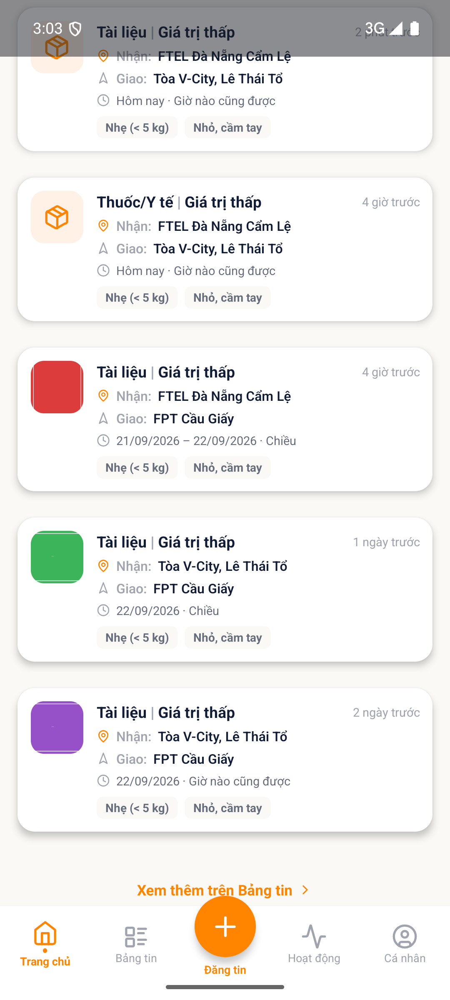
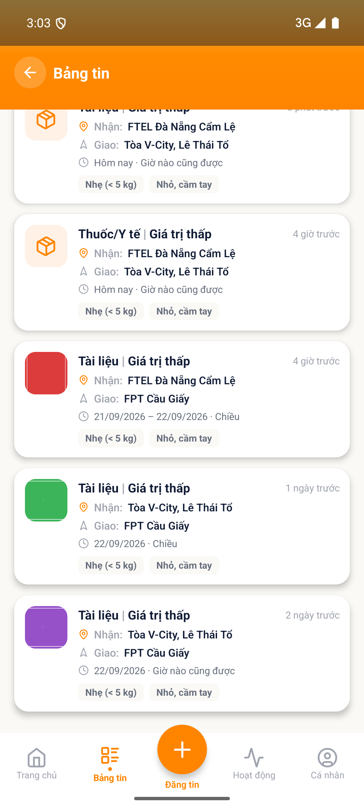

# [HOME - Trang chủ] - Nút Xem thêm trên Bảng tin hiện khi đúng 5 tin

> Jira: [FE-309](https://foxproject.atlassian.net/browse/FE-309) · Status: To Do · Assignee: Tuanvm37

<!-- jira:description:start — copy nguyên khối dưới đây vào field Description của Jira -->

**I. Môi trường**

- URL: N/A (FoxEco là SDK nhúng trong host app mobile FoxPro, không có URL riêng)
- Account/Role: CBNV `Nguyễn Thị Thanh Thủy` (`stag_thuyntt22@`) — tài khoản không có tin nào của chính mình
- Trình duyệt / Thiết bị: emulator-5554 (Android 13, 1080×2400), UiAutomator2
- Build/Version: STG · v1.1 · host app `com.hrisproject.stag` (FoxPro)

**II. Mô tả Bug**

**Pre-condition:**

- Hệ thống có **đúng 5 tin NEED hợp lệ** (chưa ghép, chưa hết hạn), người xem không có tin nào của chính mình. *(Đã xác nhận bằng tab "Bảng tin" của chính tài khoản: `feed-post-card-0..4` = 5 tin.)*

**Steps:**

1. Đăng nhập app FoxPro → menu "Chức năng" → nhấn icon FoxEco
2. Mở tab "Bảng tin", cuộn hết danh sách và đếm: đúng 5 tin
3. Về tab "Trang chủ"
4. Đếm số tin ở section "Tin mới" rồi cuộn xuống cuối section

**Expected result:**

- Section hiển thị đúng 5 tin và cuối section **KHÔNG có** nút "Xem thêm trên Bảng tin". Căn cứ `AC-11.1.01` / `SC-HOME-021`: nút chỉ hiện khi **hơn 5** tin hợp lệ; *"nếu tổng tin hợp lệ ≤5 thì nút KHÔNG hiện"*.

**Actual result:**

- "Tin mới" hiện 5 tin **và có nút `Xem thêm trên Bảng tin ›`** ở cuối section.
- Đối chiếu: khi hệ thống chỉ có **4** tin (cùng tài khoản, trước khi đăng thêm 1 tin) thì cuối section **không có** nút ⇒ app hiện nút từ **`≥ 5`** thay vì `> 5`.

**Hình ảnh mô tả:**

<!-- jira:description:end -->

## Status History

| Ngày | Status | Ghi chú | Ref |
|---|---|---|---|
| 2026-09-21 | Pushed | Soạn từ `TC-HOME-025` FAIL (VR-014); push Jira `FE-309`, assign Tuanvm37, đính kèm ảnh | |

## Ghi chú nội bộ (không push Jira) — 🔎 phần để QC review

- **Có phải bug thật không? — CÓ THỂ, tin cậy trung bình:** Expected khớp `SC-HOME-021`; nhưng số tin "hợp lệ" trên STG **bị người khác đăng song song** (giữa phiên xuất hiện tin lạ), nên biên 5 phải đo ngay trước khi kết luận — đã đo trước và sau. Chưa thử biên bằng cách bớt tin (5 → 4 sau khi đã có nút) để xác nhận chắc.
- Nếu BA chốt ngưỡng là `≥ 5` thì sửa `SC-HOME-021`/`TC-HOME-025` thay vì log bug.
- Mức đề xuất: P3 · Low.
