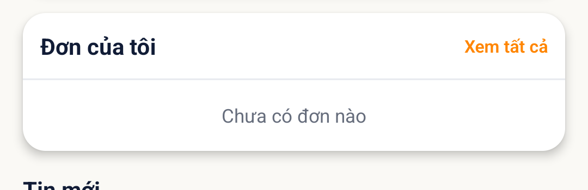

# [HOME - Trang chủ] - Empty state Đơn của tôi sai chuỗi, thiếu CTA và icon

> Jira: [FE-310](https://foxproject.atlassian.net/browse/FE-310) · Status: To Do · Assignee: Tuanvm37

<!-- jira:description:start — copy nguyên khối dưới đây vào field Description của Jira -->

**I. Môi trường**

- URL: N/A (FoxEco là SDK nhúng trong host app mobile FoxPro, không có URL riêng)
- Account/Role: CBNV `Nguyễn Thị Thanh Thủy` (`stag_thuyntt22@`) — tài khoản "sạch": 0 đơn đang chạy, 0 đóng góp
- Trình duyệt / Thiết bị: emulator-5554 (Android 13, 1080×2400), UiAutomator2
- Build/Version: STG · v1.1 · host app `com.hrisproject.stag` (FoxPro)

**II. Mô tả Bug**

**Pre-condition:**

- Tài khoản không có đơn nào đang chạy (hero `0 · Chưa có đóng góp nào`).

**Steps:**

1. Đăng nhập app FoxPro bằng tài khoản không có đơn → menu "Chức năng" → nhấn icon FoxEco
2. Mở tab "Trang chủ"
3. Quan sát section "Đơn của tôi"

**Expected result:**

- Section "Đơn của tôi" **vẫn hiển thị**, bên trong có **icon nét mảnh**, dòng **"Bạn chưa có đơn nào đang chạy"** và nút CTA **"Tạo đơn gửi hàng"** *(TC-HOME-027; PRD `DOC-v1.1-01` §8.17.1, `EMP-02`; BA chốt hiển thị ở `C-HOME-05`)*.

**Actual result:**

- Section vẫn hiển thị *(đúng)*, nhưng bên trong chỉ có dòng **"Chưa có đơn nào"** — sai chuỗi `EMP-02`; **không có** nút "Tạo đơn gửi hàng"; **không thấy** icon.
- Đối chiếu cùng màn: empty state của "Tin mới" hiển thị đúng chuỗi `EMP-01` ⇒ chỉ `EMP-02` lệch.

**Hình ảnh mô tả:**

<!-- jira:description:end -->

## Status History

| Ngày | Status | Ghi chú | Ref |
|---|---|---|---|
| 2026-09-21 | Pushed | Soạn từ `TC-HOME-027` FAIL (VR-014); push Jira `FE-310`, assign Tuanvm37, đính kèm ảnh | |

## Ghi chú nội bộ (không push Jira) — 🔎 phần để QC review

- **Có phải bug thật không? — CÓ THỂ, tin cậy trung bình-cao:** app hiện `Chưa có đơn nào` (chuỗi ngắn kiểu v1.0?) trong khi PRD v1.1 chốt `EMP-02`. Nếu BA/dev xác nhận bản build STG chưa cập nhật `EMP-02` thì vẫn là bug "chưa làm theo PRD". Nếu BA đổi ý về chuỗi thì sửa `TC-HOME-027`.
- Tài khoản test "sạch" = `stag_thuyntt22@` (0 đơn · 0 đóng góp) — dùng lại được để tái hiện; ⚠️ đừng dùng cho việc khác trước.
- `defect_type: Interface` là lựa chọn của người soạn (lệch spec, không phải lỗi logic) — QC chỉnh nếu board dùng giá trị khác.
- Mức đề xuất: P3 · Low.
