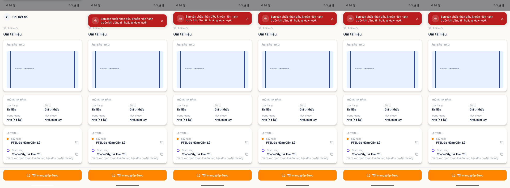

# [ASN - Ghép nối] - Ghép chuyến bị chặn đòi chấp nhận điều khoản nhưng PRD không quy định

> Jira: [FE-311](https://foxproject.atlassian.net/browse/FE-311) · Status: To Do · Assignee: Tuanvm37

<!-- jira:description:start — copy nguyên khối dưới đây vào field Description của Jira -->

**I. Môi trường**

- URL: N/A (FoxEco là SDK nhúng trong host app mobile FoxPro, không có URL riêng)
- Account/Role: CBNV `Nguyễn Thị Thanh Thủy` (`stag_thuyntt22@`, MNV `00002352`) — vai người vận chuyển (Carrier); tài khoản chưa từng đăng tin/ghép chuyến (0 đơn đã giúp)
- Trình duyệt / Thiết bị: emulator-5554 (Android 15, 1080×2400), UiAutomator2
- Build/Version: STG · v1.1 · host app `com.hrisproject.stag` (FoxPro)

**II. Mô tả Bug**

**Pre-condition:**

- Có 1 tin NEED đang `Chờ ghép` do người khác đăng (không phải của tài khoản test, không khai tài khoản test là người nhận).
- Tài khoản test chưa từng đăng tin hay ghép chuyến.

**Steps:**

1. Đăng nhập app FoxPro bằng `stag_thuyntt22@` → menu "Chức năng" → nhấn icon FoxEco
2. Mở tab "Bảng tin" → nhấn vào 1 tin `Chờ ghép` của người khác
3. Nhấn nút "Tôi mang giúp được"
4. Trong modal "Xác nhận mang giúp" nhấn "Xác nhận"

**Expected result:**

- Theo PRD v1.1 (`DOC-v1.1-01`): luồng ghép chỉ có modal xác nhận lộ SĐT; **"Ghép ngay khi người vận chuyển bấm nhận — không có bước chủ tin duyệt"** (`§8.3.1 BR03-01`). Điều khoản miễn trừ chỉ được yêu cầu **trước khi đăng tin/đăng tuyến** (`§8.1.1 BR01-07`, `§8.18.2 VAL-01`, `§9 NFR-13`: *"hiển thị và bắt buộc tick trước khi đăng tin/đăng tuyến"*). ⇒ đơn được ghép, mở màn "Theo dõi đơn".
- *(Nếu nghiệp vụ thực sự muốn chặn ghép khi chưa consent — như `DOC-v1.0-01 §A8`: "buộc consent trước khi đăng/ghép" — thì luồng ghép phải có chỗ để người dùng đọc và chấp nhận điều khoản.)*

**Actual result:**

- Modal đóng, xuất hiện toast đỏ **"Bạn cần chấp nhận điều khoản hiện hành trước khi đăng tin hoặc ghép chuyến"**; người dùng ở lại "Chi tiết tin", **không ghép được**.
- Trong luồng ghép **không có** checkbox, đường dẫn, link đọc hay màn nào để chấp nhận điều khoản ⇒ người dùng bị chặn mà không biết chấp nhận ở đâu.
- Đối chứng: `stag_anhptm17@` (đã có 6 đơn đã giúp) và `stag_taipm@` cùng thao tác trên cùng loại tin → ghép được, không hiện toast này.

**Hình ảnh mô tả:**

<!-- jira:description:end -->

## Status History

| Ngày | Status | Ghi chú | Ref |
|---|---|---|---|
| 2026-09-21 | Pushed | Push Jira `FE-311` (assignee Tuanvm37, đính kèm ảnh id 31783); các field khác QC tự chỉnh trên Jira |  |
| 2026-09-21 | Open | Phát hiện khi chạy `TC-ASN-006` lần 1 (16:13, VR-015): người bấm `Xác nhận` trên emulator bị toast chặn. QC yêu cầu rà PRD rồi log nếu PRD không có rule | VR-015 |

## Ghi chú nội bộ (không push Jira) — 🔎 phần để QC review

- **Kết quả rà tài liệu (trả lời "hệ thống có rule này không"):**
  - **PRD v1.1 (`00_input/v1.1/FoxEco PRD v1.0 - Gui Hang.pdf`)** — consent chỉ ở **đăng tin/đăng tuyến**: `BR01-07` · `§8.1.4` (checkbox chưa tick) · `VAL-01` · `NFR-13` (*"hiển thị và bắt buộc tick trước khi đăng tin/đăng tuyến; nội dung consent được lưu kèm phiên bản điều khoản"*). **Không có** câu nào nói ghép chuyến bị chặn khi chưa chấp nhận điều khoản; `BR03-01..06` (luồng ghép) không nhắc consent.
  - **BRD v1.0 §A8 (`DOC-v1.0-01` L115)** — *"buộc consent trước khi đăng/ghép"* → **rộng hơn** PRD v1.1. `analyze-requirements` v1.0 đã nêu đúng khoảng trống này ở **`RISK-TS-04`** (*"luồng ghép chỉ có modal xác nhận lộ SĐT, không phải consent điều khoản"*), đề nghị hỏi BA — **`CL-hoi-BA-v1.1.xlsx` không có câu trả lời nào** cho câu này ⇒ **vẫn treo**.
  - ⇒ Hành vi của app **khớp BRD v1.0 §A8** nhưng **không có căn cứ trong PRD v1.1** (bản hiện hành). Cụm *"điều khoản hiện hành"* (tức có **phiên bản** điều khoản buộc chấp nhận lại) cũng chỉ mới lờ mờ ở `NFR-13` (lưu phiên bản), **không** có rule "chặn khi điều khoản đổi".
- **Vì sao xếp `defect_type = Requirement` (không phải `Logic`):** app chặn theo 1 rule mà PRD hiện hành không viết ⇒ nghiêng về *spec thiếu/không khớp*. Nếu BA xác nhận "chặn ghép khi chưa consent là ĐÚNG" thì phần còn lại là **UX thiếu lối chấp nhận** (`Interface`/`Usability`) và có thể **đổi lại loại** hoặc chuyển thành ticket yêu cầu BA cập nhật PRD.
- **Chưa kiểm (đừng khẳng định quá mức):** chỉ quan sát **trong luồng ghép**. **Chưa thử** đường "chấp nhận" qua wizard *Đăng tin* (checkbox điều khoản ở bước 3) hay `Cá nhân → Cập nhật thông tin` — vì tick ở đó sẽ **đổi trạng thái** tài khoản `stag_thuyntt22@` (tài khoản "sạch" còn cần cho `TC-HOME-027/028/029`, `TC-GIFT-008`, `TC-USR-040/043`). Nếu đăng tin xong mà ghép được ⇒ xác nhận giả thuyết *"consent chỉ lấy được ở luồng đăng"* ⇒ **người chỉ muốn chở hàng (chưa từng đăng tin) không có lối vào**.
- **Mới thấy trên 1 tài khoản** (`stag_thuyntt22@`) và chỉ **1 lần** (16:13; lặp lại 1 lần lúc 16:14 cho thấy toast giữ nguyên nội dung). Chưa có tài khoản "sạch thứ 2" để đối chứng.
- **Mức đề xuất: P2 · Medium** — chặn hoàn toàn chức năng cốt lõi (ghép) với nhóm người dùng mới, nhưng chưa rõ đây là lỗi hay quyết định nghiệp vụ. **QC chỉnh** nếu muốn `Major`. ⛔ Không phải `Suggest`.
- **Ảnh chứng cứ:** dải 6 khung liên tiếp (mỗi ~0.25s) — khung 1 chưa có toast, khung 2–6 hiện toast; đọc rõ nội dung ở khung 2. Ảnh nằm trong `08_test-runs/vibe/VR-015-ASN-2026-09-21/screenshots/` (tên `_recon__…` vì đây là lần chạy không hợp lệ của `TC-ASN-006`, không phải evidence PASS/FAIL của TC).
- **Test data đi kèm:** `stag_thuyntt22@` đến giờ vẫn **chưa chấp nhận điều khoản** (nếu không ai đăng tin bằng tài khoản này sau 16:14 ngày 2026-09-21).
- Đã push Jira `FE-311` 2026-09-21: `Parent=FE-1` · `Fix versions=V1.0` · `Test Round=1` · Priority High · Severity 5 · Platform App · Effect Functionality · Defect Type Requirement · Test method Manual · labels `bug-027, tc-asn-006, sc-asn-006, req-asn-003`. ⚠️ Trên Jira, dòng Expected thứ 2 (phần *Nếu nghiệp vụ thực sự muốn chặn ghép…*) bị render lệch định dạng italic/code — QC sửa tay nếu cần.
